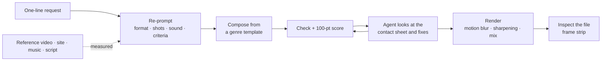

<div align="center">


# Motion Director

**Say one sentence. Get motion graphics a director would sign off on.**

A motion-graphics skill + MCP server + render engine for Claude, Codex and ChatGPT.

[](LICENSE) [](package.json) [](mcp/server.mjs) [](SKILL.md)

[한국어](README.md) · [Landing page](https://zzombie04.github.io/motion/) · [7 samples](samples/README.md) · [Templates](#templates) · Made by [AI리치쌤](https://joo.is/AI%EB%A6%AC%EC%B9%98%EC%8C%A4)

</div>

---

You ask in plain words, with no camera or animation vocabulary.

```
Make a 15-second vertical teaser for our new note app. Upbeat.
```

The agent then works like a director:

1. **Re-prompts** your sentence into a treatment: format, shot list with timecoded beats, camera, transitions, type, sound and acceptance criteria.
2. **Writes** a deterministic HTML + GSAP composition from a genre template.
3. **Measures and scores** the frames itself, looks at a contact sheet and fixes what it sees.
4. **Renders** an MP4 with real motion blur and a mixed, loudness-normalised soundtrack.
5. **Inspects the output file** before handing it over.

| | | |
|:-:|:-:|:-:|
|  |  |  |
| Course promo short | Sports-day opener | App walkthrough |
|  |  |  |
| Data for a talk | Three-step explainer | Channel end card |

Every sample started from a one-line request with no technique names. Request, treatment, code and video are all in [`samples/`](samples/README.md). The samples are in Korean because the project was built for Korean teachers and creators. The engine handles any language, and Hangul gets a few extras such as jamo-by-jamo typing.

## What makes it different

| | |
|---|---|
| **Re-prompts like a director** | It extracts purpose, message and video type, then picks a hook, camera move, transition and payoff that fit. Twelve playbooks cover promos, product launches, narrated explainers, data stories, music videos, UI demos, logo stings, overlays, loops, 3D heroes, "make it like this reference" and personalised batches. |
| **Measures the materials first** | A reference video becomes a shot sheet with cut rhythm, motion energy, palette and BPM. A website URL becomes `brand.json` with real colours, fonts, logo and copy. A song becomes beats and downbeats. |
| **Sound design built in** | Twenty sound effects are synthesised in code, so there are no files or licences to manage. Add `sfx: true` to a move and a matching sound lands on the exact frame. Music is beat-tracked, ducked under voice and normalised to −14 LUFS. |
| **Word-level captions** | Give it a script and a recording. It finds the pauses, aligns sentences, then times every word. Styles are karaoke, pop, box and line. |
| **A real motion vocabulary** | Mask reveals, Hangul jamo typing, curved cursor paths and drags, spring physics, shape morphing, a 3D camera with depth and rack focus, and devices with real thickness. It also does WebGL 3D, Lottie, charts and 16 transitions including glitch, light leak, clock wipe, blinds and warp. |
| **Checks its own work** | It measures overlap, clipping, legibility, dead air, sound and loop seams on the real frames. Then it gives a 100-point director score with a slideshow-risk rating. The agent looks at the contact sheet and fixes. After render it checks the file for black frames, freezes and loudness, and makes a frame strip. |
| **Cinematic render** | Real motion blur samples fast frames up to 32 times while the virtual shutter is open. Tilted 3D screens that zoom in are captured at 2–3× and scaled down, so small text stays sharp. |
| **One video, many versions** | Expose text, images and colours as template variables. One CSV then renders a version per student, class or product. |
| **Works everywhere** | Claude Code and Codex skill, an MCP server with 22 tools for Claude Desktop and others, custom-GPT instructions, and a CLI. |

## How it works



A composition is **one paused timeline**. Every frame is a pure function of time, so preview and render match exactly and the same file renders identically on any machine.

## Install

You need Node.js 18+, Chrome or Edge, and ffmpeg.

```bash
git clone https://github.com/ZZombie04/motion.git
cd motion
npm install
node bin/motion.mjs doctor
npm test
```

### Connect

```bash
node scripts/connect.mjs          # skill for Claude Code and Codex
node scripts/connect.mjs --mcp    # also register the MCP server (Claude Code, Codex, Claude Desktop)
node scripts/connect.mjs --remove # undo
```

| Client | How it connects |
|---|---|
| Claude Code | `~/.claude/skills/motion` points to this folder. Start a new session and ask for a video. |
| Codex | `~/.codex/skills/motion` plus `[mcp_servers.motion]` in `~/.codex/config.toml` |
| Claude Desktop and other MCP clients | `node <this folder>/mcp/server.mjs` over stdio. Work goes to `~/Motion`, or set `MOTION_WORKSPACE`. |
| ChatGPT custom GPT or project | Use [`gpt/INSTRUCTIONS.md`](gpt/INSTRUCTIONS.md) as instructions and `references/` as knowledge. Render the HTML locally with `motion render`. |

## Usage

In a connected Claude Code or Codex session, just ask:

```
A vertical celebration video for our class anthology. Use this song → song.mp3
A 20-second school intro in the style of https://our-school.example
Make it like this → reference.mp4
Here is a script and a recording. Turn it into a captioned explainer short → script.txt, voice.wav
One version per student → roster.csv
```

Follow up with "make the accent green", "cut it to 8 seconds" or "now a landscape version".

By hand:

```bash
node bin/motion.mjs new work/intro.html --template hook
node bin/motion.mjs preview work/intro.html
node bin/motion.mjs check work/intro.html
node bin/motion.mjs score work/intro.html
node bin/motion.mjs sheet work/intro.html --count 18
node bin/motion.mjs render work/intro.html --quality final
```

| Command | |
|---|---|
| `brief "request"` | Draft treatment with format, length, look, direction options and a beat-sheet skeleton |
| `analyze ref.mp4` | Cut rhythm, motion, palette and BPM of a reference, plus a shot sheet |
| `brand https://…` | Colours, fonts, logo and copy of a site, saved as `brand.json` |
| `audio song.mp3` | BPM, beats, downbeats and hits |
| `captions plan` · `align` | Script to cue times before recording, or aligned to a recording down to the word |
| `templates` · `new` | List genre templates, or start a composition with `--template` and `--brand` |
| `check` · `score` | Automatic checks, and the 100-point director score with slideshow risk |
| `sheet` · `frames` · `probe` | Contact sheet (`--beats music` for one frame per beat), full-size stills, page values |
| `render` | `--quality draft·standard·final`, `--format mp4·webm·mov·gif·webp·png`, `--alpha`, `--scale 2` for 4K, `--vars`, `--no-audio` |
| `verify` | Inspect an output file for size, length, black frames, freezes and loudness, plus a frame strip |
| `vars` · `batch` | List template variables, or render one video per CSV row |
| `sfx` · `preview` · `doctor` | List sound effects, open the scrubbable preview, check the environment |

## Templates

| Name | Format | Use |
|---|---|---|
| `hook` | 9:16 · 8 s | Number hook, problem, result, end card. The default promo short. |
| `beat` | 9:16 · 10 s | One word per bar with colour flips and a flash. Drop in a song and it follows the song's beats. |
| `captions` | 9:16 · 16 s | Narrated explainer with word captions and a new picture per sentence |
| `data` | 16:9 · 14 s | Question, bars against the average, donut, big number, takeaway |
| `launch` | 16:9 · 15 s | Launch teaser with feature callouts on a laptop screen, a key number and a call to action. Pairs with `--brand`. |
| `hero3d` | 16:9 · 8 s | A metal sculpture turning under studio light, plus a title. Real WebGL. |
| `lowerthird` | 16:9 · 6 s | Name tag on a transparent background, for overlaying in an editor |
| `loop` | 1:1 · 6 s | Seamless loop background for GIFs and waiting screens |
| `ui` | insert · 6.5 s | Input to result UI demo |
| `blank` | 9:16 · 8 s | Empty stage |

Any sample works as a starting point too, for example `--template samples/02-sports-day.html`.

## MCP tools

`motion_brief` · `motion_guide` · `motion_templates` · `motion_new` · `motion_write` · `motion_read` · `motion_vars` · `motion_check` · `motion_score` · `motion_sheet` · `motion_frames` · `motion_render` · `motion_render_status` · `motion_verify` · `motion_batch` · `motion_analyze` · `motion_brand` · `motion_audio` · `motion_captions` · `motion_sfx` · `motion_preview` · `motion_doctor`

Contact sheets, stills, output strips and reference shot sheets come back **as images**, so the model sees its own frames and fixes them.

## Layout

```
SKILL.md              the skill: workflow and hard rules
references/           director · playbooks · look · motion · sound · captions · engine (API) · recipes (42) · quality · chat-mode
engine/               runtime motion.js · motion.css · icons · fonts
lib/ · bin/           renderer · checker · score · output inspection · sound (analysis, synthesis, mix) · captions · reference analysis · brand · batch · CLI
mcp/server.mjs        MCP server
templates/            genre starter templates
gpt/INSTRUCTIONS.md   custom-GPT instructions
samples/              request → treatment → code → video
```

The documentation under `references/` is written in Korean. Models read it fine whatever language you ask in.

## Credits and licence

The directing method generalises an analysis of Career Hacker Alex's [motion-graphics kit](https://www.careerhackeralex.com/sharings/cha-motion-kit) ([analysis](docs/site-analysis.md)). None of that site's prompts, videos or source is included.
Code and docs are MIT. Fonts (Pretendard, Geist, Instrument Serif, OFL), icons (Lucide, ISC) and installed dependencies are listed in [`NOTICE.md`](NOTICE.md).

---

<div align="center">

Made by **[AI리치쌤](https://joo.is/AI%EB%A6%AC%EC%B9%98%EC%8C%A4)** · [joo.is/AI리치쌤](https://joo.is/AI%EB%A6%AC%EC%B9%98%EC%8C%A4)

</div>
