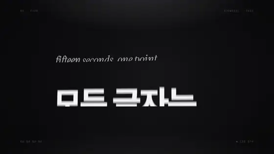
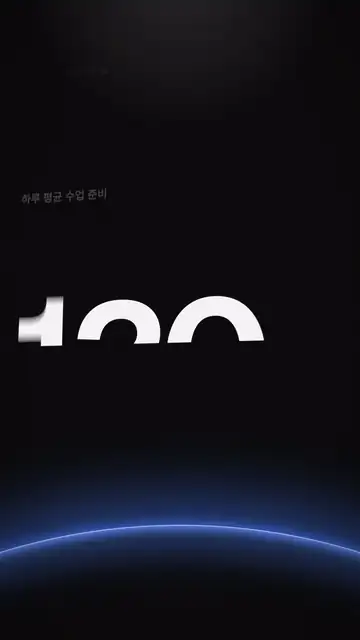
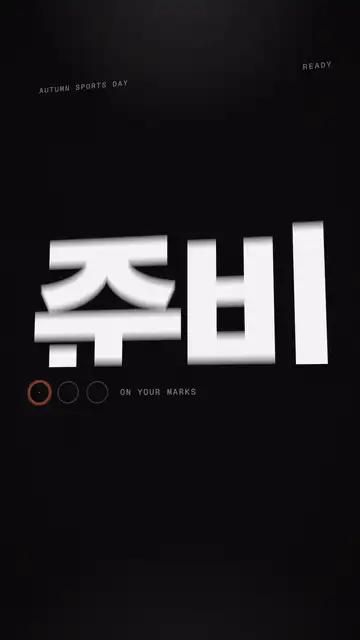
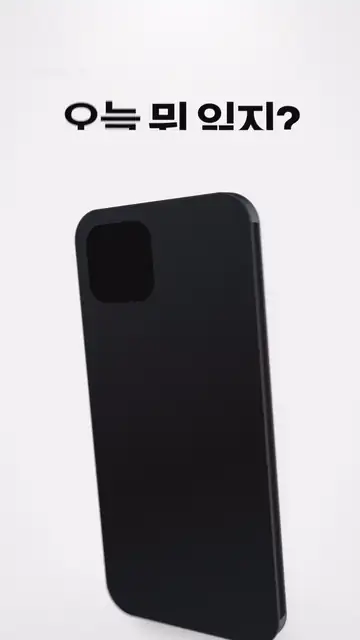
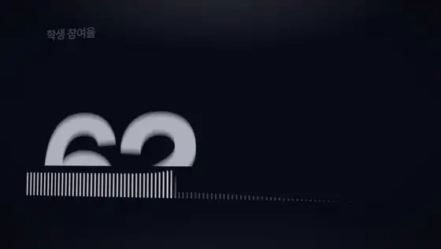
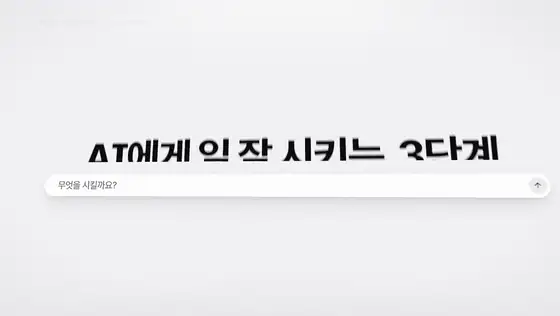
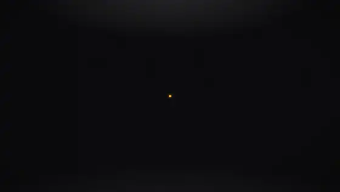
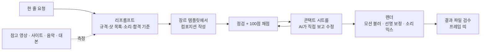

<div align="center">



# Motion Director

**말 한마디를, 감독이 연출한 모션그래픽으로.**

Claude · Codex · ChatGPT에 붙이는 모션그래픽 스킬 + MCP 서버 + 렌더 엔진

[](LICENSE) [](package.json) [](mcp/server.mjs) [](SKILL.md)

[English](README.en.md) · [소개 페이지](https://zzombie04.github.io/motion/) · [샘플 7편](samples/README.md) · [템플릿](#템플릿) · 만든 사람 [AI리치쌤](https://joo.is/AI%EB%A6%AC%EC%B9%98%EC%8C%A4)

</div>

---

"가을 운동회 홍보 쇼츠 만들어줘"처럼 **평범하게 말하면** —
AI가 감독처럼 화면 규격·샷 목록·카메라·전환·타이포·리듬·소리를 정하고(**리프롬프트**), 결정적인 HTML+GSAP 컴포지션을 쓰고, 화면을 **직접 보고 채점해서 고친 뒤**, 실제 모션 블러와 믹스된 소리로 MP4를 뽑고, 결과 파일까지 다시 본다.
카메라 기법이나 모션 용어를 몰라도 된다.

```
우리 학교 가을 운동회 홍보 쇼츠 오프닝 만들어줘. 10월 23일 금요일이고, 신나게.
```

| | | |
|:-:|:-:|:-:|
|  |  |  |
| 연수 홍보 쇼츠 | 운동회 오프닝 | 앱 소개 |
|  |  |  |
| 발표용 수치 | 3단계 설명 | 채널 엔딩 |

모든 샘플은 **기법 이름이 없는 한 줄 요청**에서 시작했다. 요청 → 트리트먼트 → 코드 → 영상은 [`samples/`](samples/README.md)에.

## 무엇이 다른가

| | |
|---|---|
| **감독처럼 리프롬프트** | 요청에서 목적·메시지·영상 종류를 뽑고, 의도에 맞는 훅·카메라·전환·결과 연출을 골라 **화면 규격 → 샷 목록(타임코드 비트) → 소리 → 합격 기준**으로 확장한다. 홍보 쇼츠·제품 소개·내레이션 설명·데이터·음악·UI 시연·로고·오버레이·루프·3D·레퍼런스 따라 하기·개인화까지 12가지 플레이북 |
| **재료를 먼저 잰다** | 참고 영상을 주면 컷 리듬·움직임·색·BPM을 재서 샷 시트를 보고, 사이트 주소를 주면 실제 색·글꼴·로고·문구를 읽어 브랜드 파일을 만들고, 음악을 주면 박·마디를 잰다 |
| **소리 디자인** | 효과음 20종을 코드로 합성(파일·라이선스 불필요). 움직임에 `sfx: true`만 붙이면 어울리는 소리가 정확한 프레임에. 음악은 실제 박을 재서 컷을 맞추고, 목소리 아래로 자동 덕킹, 전체를 −14 LUFS로 |
| **단어 자막** | 대본과 녹음을 주면 쉬는 구간을 찾아 문장을 맞추고 단어 시각까지 정렬. 카라오케·팝·박스·라인 네 가지 스타일 |
| **움직임의 어휘** | 마스크 리빌, 한글 자모 타이핑, 휜 경로의 커서·끌기, 물리 스프링, 도형 모핑, 3D 카메라·깊이·랙 포커스, 두께 있는 폰·노트북, 실제 WebGL 3D, 로티, 차트, 전환 16종(글리치·빛샘·시계·블라인드·왜곡…) |
| **스스로 검수** | 실제 화면을 재는 점검(겹침·잘림·가독성·정지·소리·루프) → 100점 감독 점수와 슬라이드쇼 위험도 → AI가 콘택트 시트를 직접 보고 고친다 → 렌더 뒤 결과 파일(검은 화면·멈춤·음량)과 프레임 띠까지 |
| **영화 같은 렌더** | 셔터가 열린 동안의 움직임을 재서 빠른 프레임만 최대 32번 나눠 찍는 실제 모션 블러. 기울어진 3D 화면을 확대하는 프레임은 2–3배로 찍어 줄여 작은 글자까지 또렷 |
| **한 편을 여러 편으로** | 문구·사진·색을 템플릿 변수로 두고 표(CSV) 한 장으로 학생별·반별·상품별 영상을 일괄 렌더 |
| **어디서나** | Claude Code·Codex 스킬, MCP 서버(도구 22개 — Claude Desktop 등), 커스텀 GPT 지침, CLI |

## 작동 방식



컴포지션은 **일시정지된 타임라인 하나**다. 모든 프레임이 시간의 함수라서 미리보기와 렌더가 같은 그림을 내고, 어느 컴퓨터에서 몇 번을 돌려도 같은 영상이 나온다.

## 설치

필요한 것: Node.js 18+, Chrome 또는 Edge, ffmpeg.

```bash
git clone https://github.com/ZZombie04/motion.git
cd motion
npm install
node bin/motion.mjs doctor
npm test
```

### 연결

```bash
node scripts/connect.mjs          # Claude Code · Codex에 스킬로 연결
node scripts/connect.mjs --mcp    # MCP 서버까지 등록(Claude Code · Codex · Claude Desktop)
node scripts/connect.mjs --remove # 해제
```

| 환경 | 연결되는 방식 |
|---|---|
| Claude Code | `~/.claude/skills/motion` → 이 폴더. 새 세션에서 "…영상 만들어줘" |
| Codex | `~/.codex/skills/motion` + `~/.codex/config.toml`의 `[mcp_servers.motion]` |
| Claude Desktop 등 MCP 클라이언트 | `node <이 폴더>/mcp/server.mjs` (stdio). 작업 폴더는 `~/Motion`(`MOTION_WORKSPACE`로 변경) |
| ChatGPT 커스텀 GPT·프로젝트 | [`gpt/INSTRUCTIONS.md`](gpt/INSTRUCTIONS.md)의 지침 + `references/`를 지식 파일로. 결과 HTML은 로컬에서 `motion render` |

## 쓰는 법

스킬이 연결된 Claude Code·Codex에서 그냥 말한다.

```
우리 반 학급 문집 완성 축하 영상, 세로로. 음악은 이 파일로 → song.mp3
https://우리학교.kr 느낌으로 학교 소개 영상 20초
이 영상처럼 만들어줘 → 참고.mp4
대본이랑 녹음 줄게, 자막 들어간 설명 쇼츠로 → 대본.txt, 녹음.wav
반 아이들 이름으로 한 편씩 → 명단.csv
```

AI가 하는 일: 재료 측정 → 트리트먼트를 짧게 보여 줌 → 장르 템플릿에서 작성 → 점검·채점 → 시트를 보고 수정 → 렌더 → 결과 검수 → 파일 경로와 바꿀 수 있는 것 안내.
이어서 "포인트 색을 초록으로", "8초로 줄여줘", "가로 버전도"처럼 말하면 된다.

직접 다룰 때:

```bash
node bin/motion.mjs new work/intro.html --template hook        # 장르 템플릿에서 시작
node bin/motion.mjs preview work/intro.html                    # 브라우저에서 스크럽(소리·변수 패널 포함)
node bin/motion.mjs check work/intro.html                      # 자동 점검
node bin/motion.mjs score work/intro.html                      # 감독 점수 100점
node bin/motion.mjs sheet work/intro.html --count 18           # 콘택트 시트
node bin/motion.mjs render work/intro.html --quality final     # 렌더 + 결과 검수
```

| 명령 | |
|---|---|
| `brief "요청"` | 리프롬프트 초안: 화면·길이·룩·연출 후보와 비트 시트 틀 |
| `analyze 참고.mp4` | 참고 영상의 컷 리듬·움직임·색·BPM + 샷 시트 |
| `brand https://…` | 사이트의 색·글꼴·로고·문구 → `brand.json` |
| `audio 노래.mp3` | BPM·박·마디·강한 타격 |
| `captions plan` · `align` | 대본 → 자막 시간(녹음 전) · 녹음에 정렬(단어 시각까지) |
| `templates` · `new` | 장르 템플릿 목록 · 새 컴포지션(`--template`, `--brand`) |
| `check` · `score` | 자동 점검 · 100점 감독 점수 + 슬라이드쇼 위험 |
| `sheet` · `frames` · `probe` | 콘택트 시트(`--beats music` 박마다) · 원본 크기 스틸 · 페이지 안 값 확인 |
| `render` | `--quality draft·standard·final` · `--format mp4·webm·mov·gif·webp·png` · `--alpha` · `--scale 2`(4K) · `--vars` · `--no-audio` |
| `verify` | 결과 파일 검수(크기·길이·검은 화면·멈춤·음량) + 프레임 띠 |
| `vars` · `batch` | 템플릿 변수 목록 · CSV 행마다 한 편씩 |
| `sfx` · `preview` · `doctor` | 효과음 목록 · 미리보기 · 환경 점검 |

## 템플릿

| 이름 | 화면 | 쓰는 곳 |
|---|---|---|
| `hook` | 9:16 · 8초 | 숫자 훅 → 문제 → 결과 → 엔드카드, 쇼츠 홍보의 기본형 |
| `beat` | 9:16 · 10초 | 마디마다 단어 하나, 색 반전·섬광. 노래를 넣으면 그 박을 따라간다 |
| `captions` | 9:16 · 16초 | 내레이션 설명 — 단어 자막 + 문장마다 바뀌는 그림 |
| `data` | 16:9 · 14초 | 질문 → 평균과 비교한 막대 → 도넛 → 큰 숫자 → 결론 |
| `launch` | 16:9 · 15초 | 출시 티저 — 노트북 화면 속 기능 주석, 핵심 숫자, 행동 유도(`--brand`와 짝) |
| `hero3d` | 16:9 · 8초 | 스튜디오 조명 아래 도는 금속 조형 + 제목(실제 WebGL) |
| `lowerthird` | 16:9 · 6초 | 투명 배경 이름표 — 편집 프로그램에 얹는 오버레이 |
| `loop` | 1:1 · 6초 | 이음매 없는 반복 배경(GIF·대기 화면) |
| `ui` | 인서트 · 6.5초 | 입력 → 결과 화면 시연 |
| `blank` | 9:16 · 8초 | 빈 무대 |

모든 샘플(`samples/*.html`)도 `--template samples/02-sports-day.html`처럼 시작점으로 쓸 수 있다.

## MCP 도구

`motion_brief` · `motion_guide` · `motion_templates` · `motion_new` · `motion_write` · `motion_read` · `motion_vars` · `motion_check` · `motion_score` · `motion_sheet` · `motion_frames` · `motion_render` · `motion_render_status` · `motion_verify` · `motion_batch` · `motion_analyze` · `motion_brand` · `motion_audio` · `motion_captions` · `motion_sfx` · `motion_preview` · `motion_doctor`
시트·프레임·결과 띠·참고 영상 시트는 **이미지로** 돌려준다 — 모델이 직접 보고 고친다.

## 구조

```
SKILL.md              스킬 본문 — 작업 순서와 하드 룰
references/           director(연출법) · playbooks(종류별 흐름) · look · motion · sound · captions · engine(API) · recipes(42종) · quality · chat-mode
engine/               런타임 motion.js · motion.css · 아이콘 · 글꼴
lib/ · bin/           렌더러 · 점검기 · 점수 · 결과 검수 · 소리(분석·합성·믹스) · 자막 · 참고 영상 분석 · 브랜드 · 일괄 렌더 · CLI
mcp/server.mjs        MCP 서버
templates/            장르별 시작 템플릿
gpt/INSTRUCTIONS.md   커스텀 GPT 지침
samples/              요청 → 트리트먼트 → 코드 → 영상
```

## 출처와 라이선스

연출 방법론은 Career Hacker Alex의 [따라 만드는 모션그래픽 160](https://www.careerhackeralex.com/sharings/cha-motion-kit)을 분석해 일반화했다([분석 문서](docs/site-analysis.md)). 그 사이트의 프롬프트·영상·소스는 포함하지 않았다.
코드·문서는 MIT. 글꼴(Pretendard·Geist·Instrument Serif, OFL), 아이콘(Lucide, ISC), 설치 때 받는 의존성의 고지는 [`NOTICE.md`](NOTICE.md).

---

<div align="center">

만든 사람 **[AI리치쌤](https://joo.is/AI%EB%A6%AC%EC%B9%98%EC%8C%A4)** · [joo.is/AI리치쌤](https://joo.is/AI%EB%A6%AC%EC%B9%98%EC%8C%A4)

</div>
