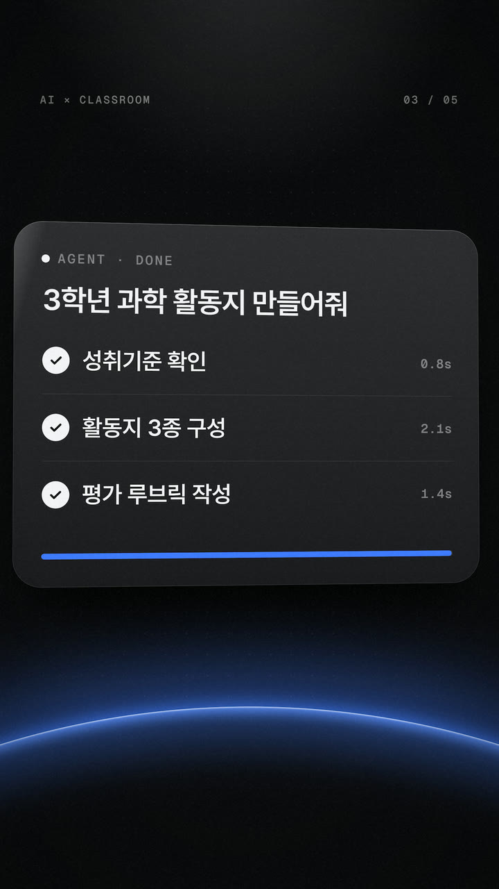
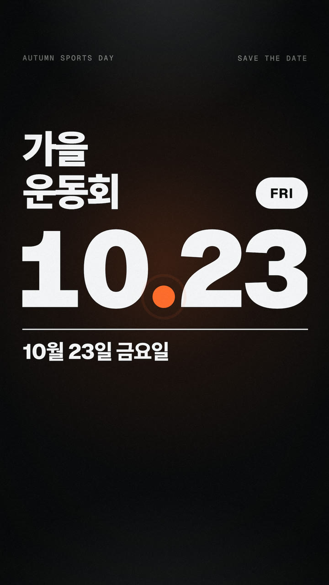
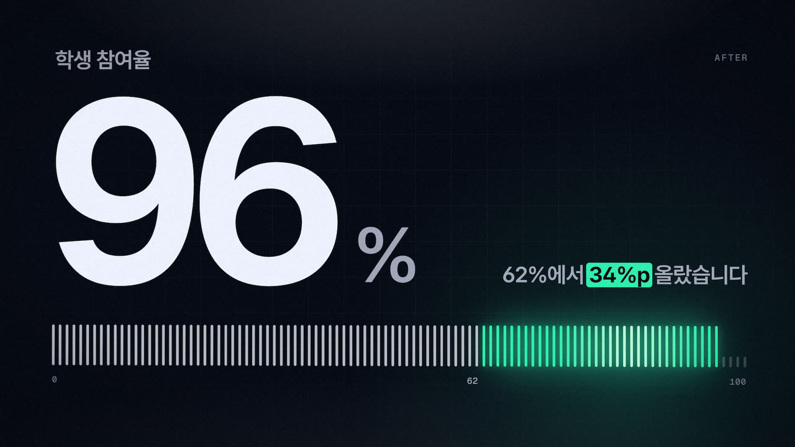
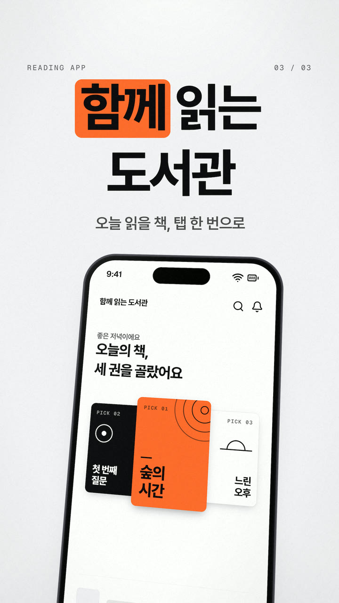
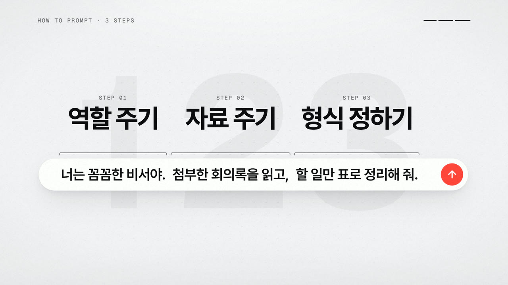
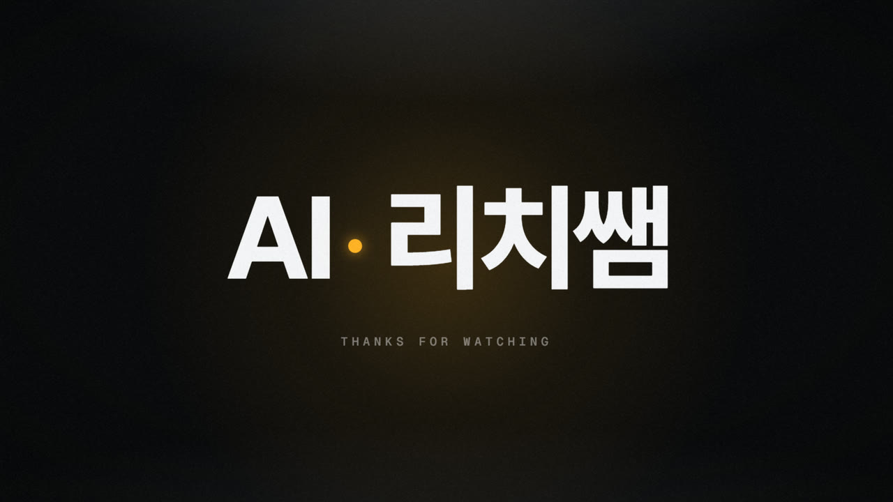
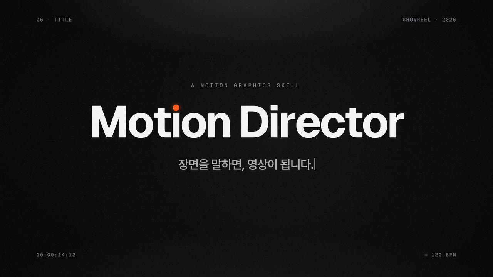

# 샘플 — 요청 한 줄에서 영상까지

일곱 편 모두 **기법 이름이 없는 평범한 요청**에서 출발했다. 연출(구조·카메라·전환·색·소리)은 스킬이 정했다.
01과 06은 엔진을 만들며 함께 다듬은 기준 작품이고, 02–05와 07은 **문서만 읽은 별도의 AI 세션**이 요청 한 줄로 만든 것이다(스킬이 예시 밖의 장면에도 통하는지 확인한 결과물). 07은 2.0의 소리·스프링·도형 모핑·차트·3D를 한 편에 담았다.
영상은 `media/`, 소스는 같은 이름의 `.html`. 다시 렌더: `node scripts/render-samples.mjs`.

| # | 요청 | 형식 | 영상 |
|---|---|---|---|
| 01 | 교사 대상 AI 연수 홍보 쇼츠. 제목은 'AI에게 일을 맡기는 교사', 수업 준비 시간이 확 줄어든다는 걸 보여줘 | 9:16 · 15.5초 | [mp4](media/01-ai-teacher.mp4) |
| 02 | 우리 학교 가을 운동회 홍보 쇼츠 오프닝 만들어줘. 10월 23일 금요일이고, 신나게 | 9:16 · 9.8초 | [mp4](media/02-sports-day.mp4) |
| 03 | 학생 참여율이 62%에서 96%로 올랐다는 걸 발표 화면에 띄울 영상으로 만들어줘 | 16:9 · 8초 | [mp4](media/03-participation.mp4) |
| 04 | '함께 읽는 도서관'이라는 독서 앱 소개 영상 만들어줘. 폰 화면에서 책 추천받는 장면이 들어가면 좋겠어 | 9:16 · 12초 | [mp4](media/04-reading-app.mp4) |
| 05 | AI에게 일 잘 시키는 3단계를 설명하는 유튜브 영상용 컷 만들어줘. 역할 주기, 자료 주기, 형식 정하기 순서야 | 16:9 · 20초 | [mp4](media/05-three-steps.mp4) |
| 06 | 채널 영상 끝에 붙일 4초짜리 로고 엔딩 만들어줘. 채널 이름은 'AI 리치쌤'이야 | 16:9 · 4초 | [mp4](media/06-logo-sting.mp4) |
| 07 | 이 스킬이 얼마나 대단한 모션 디자이너인지 보여 주는 15초짜리 모션그래픽 쇼릴을 만들어줘 | 16:9 · 15초 · 소리 | [mp4](media/07-showreel.mp4) |

화면 속 수치(120분·10분 등)와 앱 화면은 연출을 보여 주기 위한 **예시**다. 받지 않은 학교명·연도·로고·실적은 어느 샘플에도 넣지 않았다.

---

## 01 · AI에게 일을 맡기는 교사



```
메시지    AI에게 맡기면 수업 준비 120분이 10분이 된다
로그라인  입력창의 한 줄이 카드로 자라 세 단계가 끝나고, 그 진행 막대가 120분을 10분으로 줄인다
룩        ink · blue · 위에서 떨어지는 조명 + 점 격자 + 지평선의 빛 · 그레인
비트      0.0–2.9   훅 — "120분"이 솟고 "아직도 직접 하세요?"('직접' 형광펜). 비스듬한 화면이 정면으로
          2.9–6.0   요청 — "AI에게 맡기면?" 입력창에 커서가 "3학년 과학 활동지 만들어줘"를 친다
          6.0–9.1   실행 — 입력창이 카드로 자라고 친 문장이 제목이 된다. 세 단계 스피너 → 체크
          9.1–12.6  결과 — 카드가 막대 한 줄로 접히고, 그 막대가 120 → 10 카운트와 함께 줄어든다
          12.6–15.5 엔드카드 — "AI에게 일을 맡기는 교사" + "연수 신청하기", 커서 클릭
카메라    정착 → 입력창으로 다가가며 오빗 → 카드 오빗 → 정면. 전체에 드리프트와 미세한 흔들림
전환      숫자 0의 안쪽을 통과 · 입력창 → 카드 · 진행 막대 → 시간 막대 · 남은 막대 → 라벨 앞의 점
```

같은 물체가 끝까지 이어진다: **숫자의 0 → 입력창 → 카드 → 막대 → 점**. 컷은 한 번도 없다.

## 02 · 가을 운동회 오프닝



```
메시지    10월 23일 금요일, 운동회가 열린다
로그라인  주황 점 하나가 출발 신호로 터져 달리고·뛰고·던져진 끝에 "10.23"의 소수점으로 착지한다
룩        ink ↔ pop(orange) 반전 4번 · 아주 큰 Pretendard 900(달릴 땐 기울임) · 가는 흰 레인 선 · 포인트는 점 하나
비트      0.0–1.4  "준비" + 신호등 3박
          1.4–3.3  "땅!" → 박마다 "달리고 · 뛰고 · 던지고"(하드컷, 점이 궤적을 그린다)
          3.3–4.2  "함께"(pop 반전)
          4.2–6.1  "가을 운동회" + 트랙 레인 여섯 줄
          6.1–9.8  스톱워치 00.00 → "10.23" · FRI · "10월 23일 금요일", 홀드
박자      128.57 BPM(한 박 = 정확히 14프레임) — 모든 컷이 프레임 격자 위에 놓인다
전환      점이 장면마다 다른 역할로 이어진다: 신호등 → 달리는 점 → 공 → 소수점
```

기울인 글자·테마 반전·박자 컷으로 에너지를 만들되 색은 주황 하나뿐이다.

## 03 · 참여율 62 → 96



```
메시지    참여율이 96%가 됐다
로그라인  62에 서 있던 숫자와 눈금 100칸이 같은 감속으로 96까지 차오르고, 늘어난 34칸만 민트로 남는다
룩        night · mint · 남색 스튜디오 조명 · 초대형 Geist 숫자 · 눈금 100칸
비트      0.0–1.6  제시 — 비스듬한 화면이 바로 서며 "62%"(한 톤 낮게)
          1.6–4.0  상승 — 숫자와 눈금이 같은 이징으로 62 → 96, 오르면서 밝아진다
          4.0      착지 — 숫자 펄스, 마지막 칸의 물마루, 빛이 한 번 밝아졌다 가라앉는다
          4.4–5.8  해석 — "62%에서 34%p 올랐습니다"('34%p' 형광펜 = 늘어난 눈금의 색)
          5.8–8.0  홀드 — 새 요소 없이 빛만 한 번 훑는다
카메라    정착 → 끝까지 아주 느린 푸시 인
```

발표 화면용이라 한 장면에 숫자 하나만 둔다. "34%p"는 받은 두 수치에서 계산되는 값이라 썼고, 기간·원인 같은 설명은 받지 않았으므로 넣지 않았다.

## 04 · 함께 읽는 도서관



```
메시지    오늘 읽을 책을 탭 한 번으로 추천받는다
로그라인  돌아선 폰의 주황 버튼이 책 표지로 일어서고, 그 표지가 화면을 덮었다가 이름 뒤의 형광펜으로 줄어든다
룩        paper · orange · 연회색 스튜디오(색 빛 없음) · 두께가 있는 3D 폰 · 주황은 물체 하나에만
비트      0.0–2.3   훅 — "오늘 뭐 읽지?" 뒷면이던 폰이 떠오르며 돌아서고 화면이 켜진다
          2.3–3.9   진입 — 화면 속으로 다가간다. 질문은 같은 초점으로 스쳐 지나간다
          4.1–7.6   추천 — 탭 → 버튼이 가운데 표지로 일어서고 두 권이 양옆으로 펼쳐진다
          7.6–9.6   전환 — 표지를 누르면 프레임을 덮는 주황 면이 되고, "함께" 뒤의 형광펜으로 줄어든다
          8.4–12.0  엔드카드 — "함께 읽는 도서관" · "오늘 읽을 책, 탭 한 번으로" + 폰
전환      버튼 → 표지 → 주황 면 → 형광펜(같은 주황이 네 번 모양을 바꾼다)
```

화면 속 책 제목·표지·앱 화면은 연출용으로 지어낸 예시다(실제 책이나 서비스의 화면을 흉내 내지 않았다).

## 05 · AI에게 일 잘 시키는 3단계



```
메시지    역할·자료·형식, 이 세 조각을 한 문장에 담아 시킨다
로그라인  세계는 가로로 아주 긴 입력창 한 줄이다. 카메라가 그 줄을 따라가며 세 조각을 차례로 보고,
          물러나면 세 조각이 모여 한 문장이 된다
룩        paper · red · 종이 위의 은은한 조명 · 흰 입력창 한 줄 · 포인트는 빨간 점 하나
비트      0.0–2.5    타이틀 — 빈 입력창 위로 "AI에게 일 잘 시키는 3단계"
          2.5–15.2   단계 ×3 — 같은 틀 세 번: 캐럿이 먼저 건너가고 카메라가 따라가면 제목이 솟고 조각이 쳐진다
          15.2–20.0  요약 — 물러나면 세 조각이 한 줄 위에 있었다. 가운데로 모여 한 문장이 되고 전송 버튼이 켜진다
카메라    옆으로 트럭 ×2 → 풀백. 컷 없음
전환      빨간 점 하나가 끝까지 이어진다: 형광펜 → 점 → 캐럿 → 대시 → 혜성 → 전송 버튼
```

"슬라이드 세 장"이 아니라 **한 공간을 지나가는 한 번의 카메라**로 설명한다.

## 06 · 채널 엔딩 스팅



```
로그라인  점 하나가 켜져 선이 되고, 그 선에서 이름이 솟는다. 선은 다시 점으로 오므라들어 이름 사이에 남는다
룩        ink · amber · 가운데 빛 웅덩이 · 그레인
비트      0.0–0.4 점 / 0.4–1.0 선 / 0.8–1.7 이름 / 1.7–2.3 선 → 가운뎃점 / 2.2–4.0 라벨, 홀드
```

로고 파일을 받지 않았으므로 심벌을 지어내지 않고 **이름의 워드마크**로 만들었다.

## 07 · 15초 쇼릴 (2.0)



```
메시지    점 하나로 글자·도형·화면·숫자·공간을 다 연출한다 — 장면을 말하면, 영상이 된다
로그라인  문장의 마침표였던 점 하나가 도형으로 변신하고, 커서에 끌려 탭 표시가 되고, 막대로 일어서고,
          조명을 받아 진짜 구가 되었다가, "Motion"의 ı 위로 떨어져 그 점이 된다 — 컷 없이 한 물체로
룩        ink · 포인트 #FF5A1F 한 색(그 점에만) · 숫자 장면 2.5초만 paper로 반전 · 모노 HUD(장 번호·타임코드·박)
비트      0.0–2.0   글자 — 카메라가 물러나며 "모든 [글자는·도형은·화면은 → 움직임은]" 슬롯이 구르고 문장이 솟는다
          2.0–4.45  도형 — 마침표가 원 → 별 → 블롭으로, 박마다 한 번(작도선·잔상)
          4.0–6.5   화면 — glitch로 앱 창이 켜지고, 커서가 탭 표시를 끈다. 두 가장자리가 다른 스프링이라 액체처럼 늘었다 붙는다
          6.5–9.0   숫자 — blinds로 paper 반전, 탭 표시가 강조 막대로 일어선다(엔진에 든 이징·도형·전환·효과음·레시피 개수)
          9.0–12.0  공간 — 점이 실제 WebGL 구가 되고, 크롬 고리가 돌며 카메라가 다가간다
          12.0–15.0 제목 — 섬광 뒤 "Motion Director", 점이 ı 위로 떨어져 튕겨 앉고, 한 줄이 한글 자모로 쳐진다
박자      120 BPM(한 박 = 15프레임) — 모든 타격이 박 위에
소리      내장 효과음 13개(swish · pop · whoosh · glitch · click · tap · swipe · swell · riser · impact · drop · ding), 음악 없음
합격      점이 한 프레임도 끊기지 않는다 · 포인트 색은 그 점 하나 · 박마다 화면이 바뀐다 · 제목 1.2초 이상 정지
```

점검 오류 0 · 경고 0, 감독 점수 99/100. 소리는 음악 파일 없이 엔진이 합성한 효과음만 썼다.
